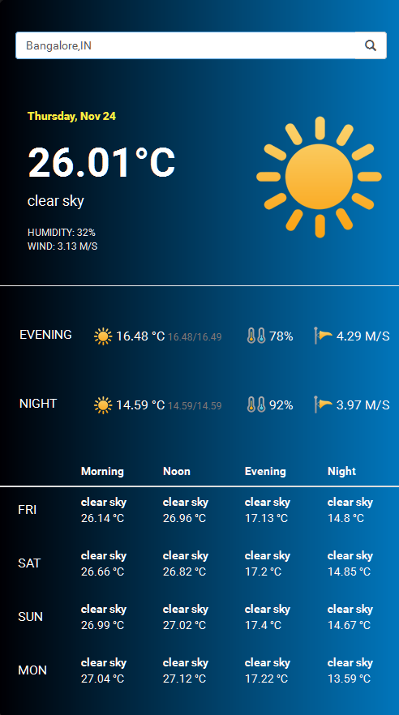

# Myweather



## Setup
- Run `npm install` from the project root to install dependencies
- Create a file `/src/config/app.config.ts` with the following contents:
````
    export const CONFIG = {
      apiEndpoint: "http://api.openweathermap.org",
      apiPath: "data/2.5/forecast",
      apiKey: YOUR_API_KEY
    };
````
The API key can be obtained by creating an account on [https://openweathermap.org](https://openweathermap.org)
- Run `npm start` and browse to `http://localhost:4200` to access the app. 

## Running unit tests

Run `ng test` to execute the unit tests via [Karma](https://karma-runner.github.io).

## Running end-to-end tests

Run `ng e2e` to execute the end-to-end tests via [Protractor](http://www.protractortest.org/).
Before running the tests make sure you are serving the app via `ng serve`.

